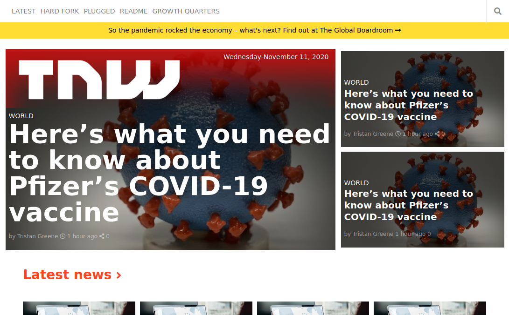

# The Next WebC lone

This is the HTML/CSS project #6, from the Microverse's main curriculum and aims to build a clone of the thenextweb.com's homepage using HTML and CSS. 



## Built With

- HTML 
- CSS layouts (flex, flexbox, grid and media query)

## Live Demo

[Live Demo Link](https://raw.githack.com/VanessaAoki/TheNextWebClone/feature/index.html) 

## Getting Started

To get a local copy up and running follow these simple example steps.

### Prerequisites

- Live Server plugin for Visual Studio Code 

### Setup

1- Clone the repository
```
https://github.com/VanessaAoki/TheNextWebClone.git
```

2- Open the folder on VS Code, right click the index.html file and click on "Open With Live Server".

3- Everything should be running by now. 


## Authors

👤 **German Aquila** 
- GitHub: [@realisticattorney](https://github.com/realisticattorney) 
- Twitter: [@ContoliAxl](https://www.twitter.com/contoliaxl)
- Linkedin: [@germanaquila](https://www.linkedin.com/in/german-aquila-55a9171b5/)  

👤 **Vanessa Aoki**

- GitHub: [@VanessaAoki](https://github.com/VanessaAoki)
- Twitter: [@VanessaSAoki](https://twitter.com/VanessaSAoki)
- Linkedin: [Vanessa Aoki](https://www.linkedin.com/in/vanessasaoki/)

## 🤝 Contributing

Contributions, issues, and feature requests are welcome!

Feel free to check the [issues page](https://github.com/VanessaAoki/TheNextWebClone/issues)

## Show your support

Give a ⭐️ if you like this project!

## 📝 License

This project is [MIT](./LICENSE).

